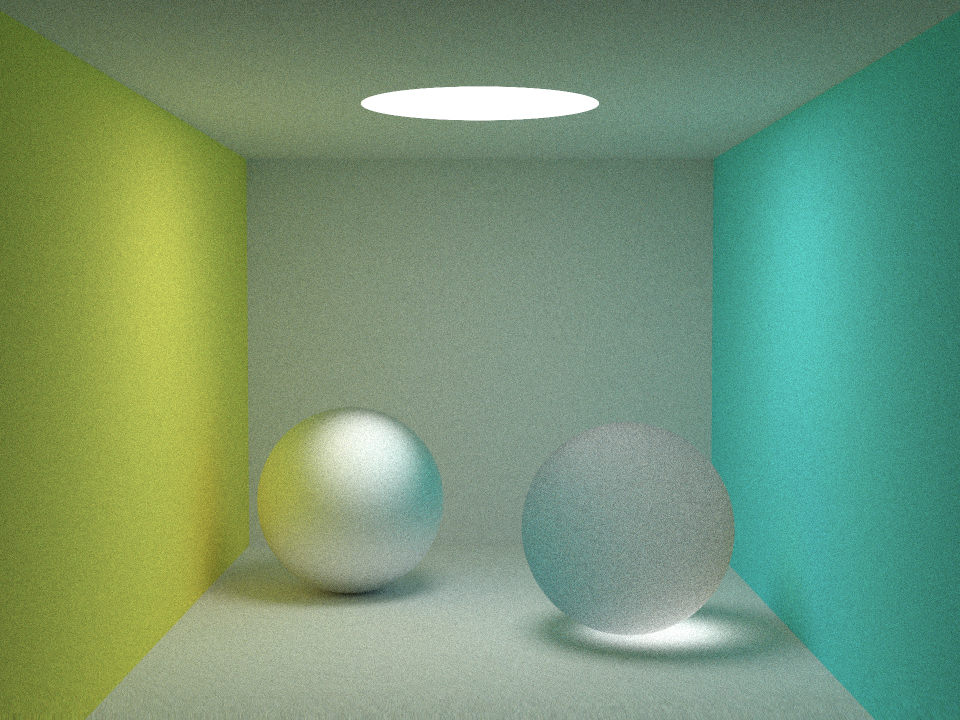
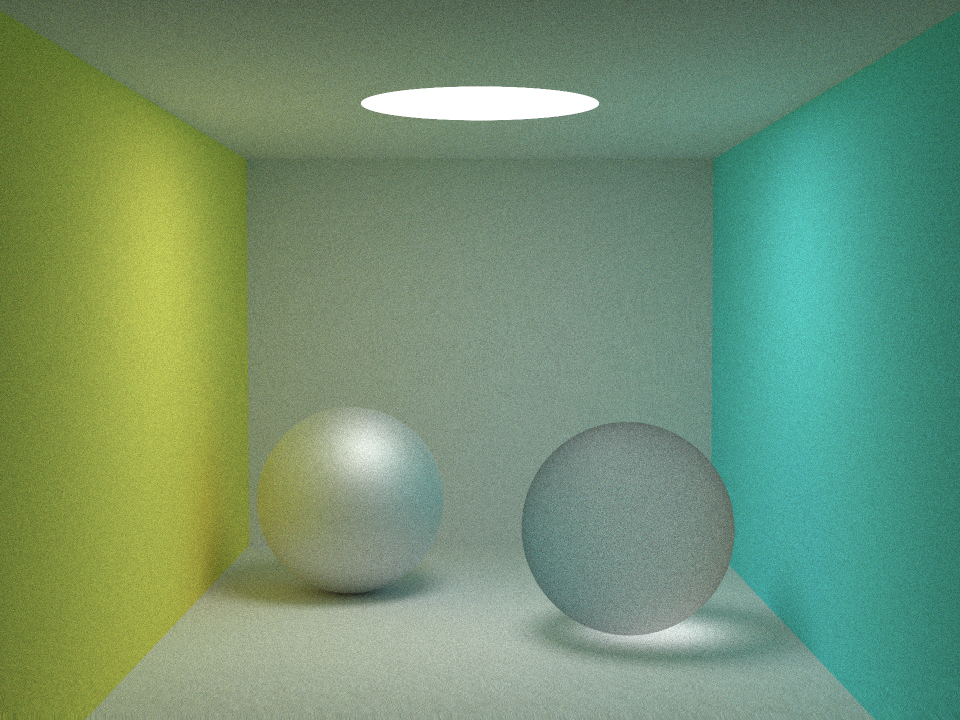

MicrofacetDistribution
===

> The simple rendering program using microfacet distribution for glossy surfaces.

## Results

Beckman (ax = 0.5, ay = 0.5) [Heitz et al. 2014]

GGX (ax = 0.5, ay = 0.5) [Heitz et al. 2014]

